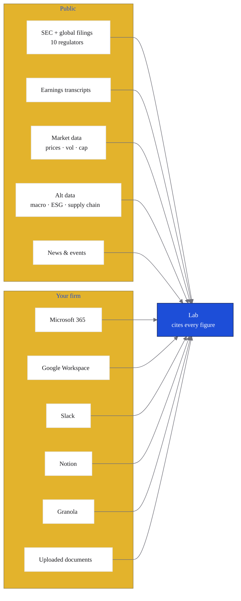

cf0 connects to 25+ live financial data sources so research is grounded in current, structured information — not stale training data. When Lab answers a question or a report assembles, it pulls from these sources in real time and traces every figure back to its origin.

## Data categories

<CardGroup cols={2}>
  <Card title="Connectors" icon="plug" href="/data/integrations">
    Microsoft 365, Google Workspace, Slack, Notion, Granola. Your firm's existing tooling becomes a queryable source.
  </Card>
  <Card title="SEC + global filings" icon="file-text" href="/data/sec-filings">
    Structured SEC filings with section-level extraction, plus international directory coverage across the major global markets your team reaches into.
  </Card>
  <Card title="Market data" icon="trending-up">
    Live and historical prices, volume, market cap, and key trading metrics across global equity markets.
  </Card>
  <Card title="Earnings transcripts" icon="mic">
    Earnings call transcripts with speaker attribution. Search by company, quarter, or speaker to surface management commentary alongside the financial results.
  </Card>
  <Card title="Alternative data" icon="globe">
    Macro indicators, geopolitical event feeds, energy data, supply chain risk scores, ESG metrics, and congressional trading disclosures — sourced from specialised providers and refreshed in real time.
  </Card>
  <Card title="News & events" icon="newspaper">
    Financial news feeds and event monitoring, including natural disaster tracking and global event data relevant to portfolio companies and sectors.
  </Card>
</CardGroup>

## Citations on every figure

Every number cf0 surfaces in Lab or a report includes a citation linking back to its exact source — the specific filing, transcript, data feed, or provider. You always know where a number came from.

<Tip>
In Lab responses and generated reports, citations appear as inline references. Click any citation to open the underlying source document or data record directly.
</Tip>

## Data privacy

cf0 doesn't share your data across organisations or use it to train AI models. Research threads, documents, and reports are scoped to your organisation's workspace and accessible only to your team.

<Note>
cf0's zero-data-retention posture means your data is never shared across organisations and never used to improve the underlying models. Your research stays yours.
</Note>
