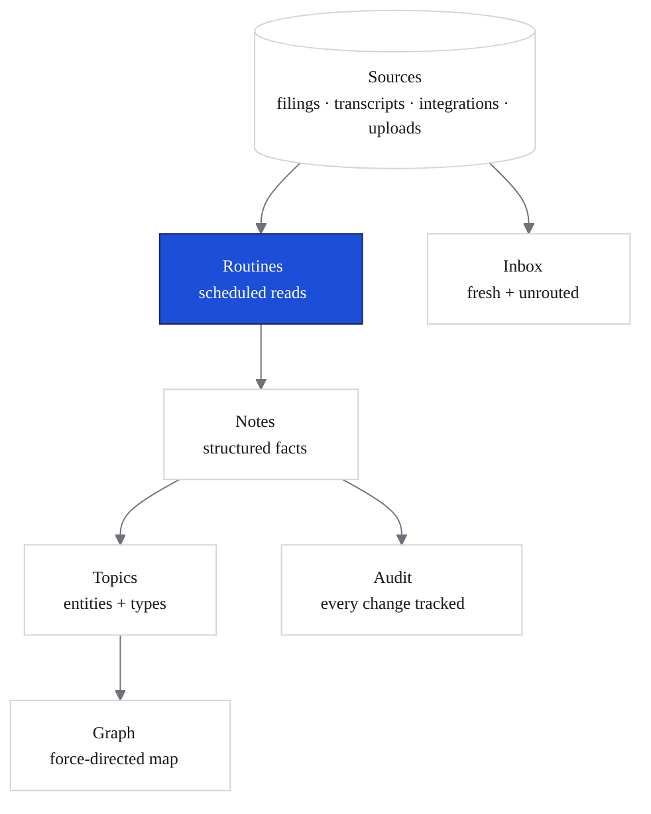

Knowledge is the surface that exposes what cf0 knows — every topic it has compiled, every note that anchors a claim, every source it has ingested, and the graph that connects them. It's the audit and inspection layer behind every Lab answer.

Open **Knowledge** from the left sidebar.

## The ten sub-views

<CardGroup cols={2}>
  <Card title="Topics" icon="list">
    The compiled view — every entity cf0 tracks (companies, people, deals, sectors) grouped by type. The default landing view of Knowledge.
  </Card>
  <Card title="Entity detail" icon="square">
    Drill into a single entity (e.g. a specific ticker or person) to see every note, source, and connection attached to it.
  </Card>
  <Card title="Notes" icon="file-text">
    Structured facts cf0 has extracted — one note per claim, with the source it came from, the date, and the topic it belongs to.
  </Card>
  <Card title="Sources" icon="database">
    Every channel feeding the knowledge surface — SEC filings, transcripts, Slack channels, Gmail labels, Notion pages, uploads. Filter by channel.
  </Card>
  <Card title="Graph" icon="share-2">
    Force-directed map of topics and the edges between them. Hover a node for the supporting notes. Useful for finding non-obvious connections.
  </Card>
  <Card title="Inbox" icon="inbox">
    New material cf0 has ingested but not yet routed to a topic. Review and approve or recategorise.
  </Card>
  <Card title="Routines" icon="clock">
    The scheduled reads that keep Knowledge fresh — ingestion jobs, summarisation passes, drift detection. See last-run status and next-run time per routine.
  </Card>
  <Card title="Audit" icon="history">
    Append-only log of every change to a note or topic — who added it, what changed, which source it came from. Compliance-grade.
  </Card>
  <Card title="Dreams" icon="sparkles">
    Speculative connections cf0 has surfaced but isn't yet confident enough to promote into the compiled view. Review and accept or dismiss.
  </Card>
  <Card title="Admin" icon="shield">
    Org-admin controls for Knowledge — managing sources, pruning topics, configuring routines. Admins only.
  </Card>
</CardGroup>

## How Knowledge feeds Lab

Every Lab thread reads Knowledge before it answers. When you ask about a name, Lab pulls relevant topics, the notes that anchor them, and the sources behind each note — alongside the SEC filings and live market data. That's why a question about a portfolio company can pull from a Granola meeting transcript and a 10-Q in the same answer: both flow through the Knowledge surface.

## Provenance, end-to-end

<Steps>
  <Step title="Source arrives">
    cf0 reads from a connected integration, an uploaded document, or a scheduled SEC ingest. The source is registered under **Sources** with a channel, a timestamp, and the ingest job that fetched it.
  </Step>
  <Step title="Notes extracted">
    A routine extracts structured notes from the source. Each note links back to the exact source passage it came from.
  </Step>
  <Step title="Notes routed to topics">
    Notes are tagged with the entities they reference (companies, people, deals). The **Topics** view aggregates notes by entity.
  </Step>
  <Step title="Lab reads from topics">
    When you ask about an entity in Lab, the model receives the topic's notes — and their sources — as context. Every answer can resolve back to its source passage.
  </Step>
  <Step title="Audit tracks every change">
    When a note is added, edited, or retracted, the Audit log records the change. The audit trail is exportable for compliance review.
  </Step>
</Steps>

## Personal vs org scope

Knowledge has two scopes:

| Scope | Sources | Notes | Visible to |
|---|---|---|---|
| **Personal** | Your uploads, your connected integrations | Notes you've authored or annotated | You only |
| **Org** | Approved org documents, org-connected integrations | Notes promoted to org scope | Every member of the org |

Switch scope from the toggle at the top of the Knowledge sidebar. Personal scope is private to you; org scope is shared with your team.

<Note>
Org scope is editable only by org admins or members who have been granted Knowledge write access. Members can always read the org scope.
</Note>

## Use Knowledge from Lab

You don't need to open Knowledge to benefit from it — every Lab thread reads from it automatically. But if you want to verify a claim, the citation on every figure links back to the underlying note in Knowledge, which in turn links to the source passage. Click any citation in a Lab response to walk the chain.

See [Citations and audit trail](/security/citations-and-audit) for the full provenance flow.
