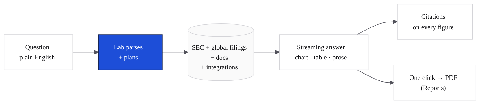

Lab is where the research happens — the surface an analyst goes to when there's a question. Type it in English, get back structured analysis: chart, table, narrative, with citations on every number. No template to fill, no dashboard to build, no formula to write. Lab picks the UI the answer needs and renders it inline.

<Frame caption="A Lab thread on an NVDA Q3 earnings preview. Source pills, three metric tiles, inline numbered citations [1][2][3], composer with `/skill` invocation. Brand-canon design surface.">
  
</Frame>

<Frame caption="The cf0 metric tile — caption-style eyebrow, tabular-numeral value, semantic delta (green up, red down), and one-line context under a hairline rule. Used wherever a number needs to be readable at a glance.">
  
</Frame>

> *"Compare AAPL and MSFT free cash flow margins over the last 5 years and flag any quarter where the gap inverted."*

That's a full Lab prompt. The thread streams a margin time-series chart, a side-by-side table with `tnum`-aligned digits, a paragraph identifying the inversion quarters, and citations linking each margin number to the underlying 10-K or 10-Q. End-to-end: under a minute.

## What ships in a response

<Frame caption="A time-series chart from a Lab response — quarterly KPI with explicit data points, semantic colour, hairline grid, brand-blue accent.">
  
</Frame>

<CardGroup cols={2}>
  <Card title="On-demand UI" icon="layout-dashboard">
    Charts, tables, metric tiles, timelines — whichever component matches the question. Real interactive components, not screenshots; hover, sort, drill in.
  </Card>
  <Card title="Cited paragraphs" icon="link">
    Every figure anchors to a source — the exact filing, page, and section. Click to open the underlying document.
  </Card>
  <Card title="Persistent threads" icon="layers">
    Each session lives in its own thread. Come back tomorrow, the context is intact.
  </Card>
  <Card title="Slash-command workflows" icon="zap">
    Type `/` to invoke any Skill — your firm's reusable research moves bound to a slug. See [Skills](/features/skills).
  </Card>
</CardGroup>

## Threads

Each Lab session is a thread. Threads persist across sessions and live under your user account.

- **New thread** — top of the sidebar
- **Switch thread** — click any thread in the sidebar list
- **Rename thread** — click the thread title and type

<Note>
Thread content is private to your user. Org admins see aggregate activity counts on the [Dashboard](/workspace/dashboard), never message bodies.
</Note>

## Citations

Every quantitative claim Lab makes links to a source — company, filing type (10-K, 10-Q, 8-K, transcript), filing date, and the specific section or table. For narrative claims, Lab reads the raw text and quotes verbatim where precision matters.

See [Citations and audit trail](/security/citations-and-audit) for how source-of-truth is generated and exported.

## Skills

Repeating workflows — DCF, comps, IC memos, earnings recaps, debt covenant checks — become **Skills**. Save the prompt once, invoke with `/skill-name` from any thread.

<Tip>
Type `/` in Lab to see all available Skills filtered live. cf0 ships with a catalogue of named system workflows — DCF, LBO, comps, IC memos, earnings recaps, monte carlo — and your org admin can encode any process your team runs. See [Skills](/features/skills).
</Tip>
