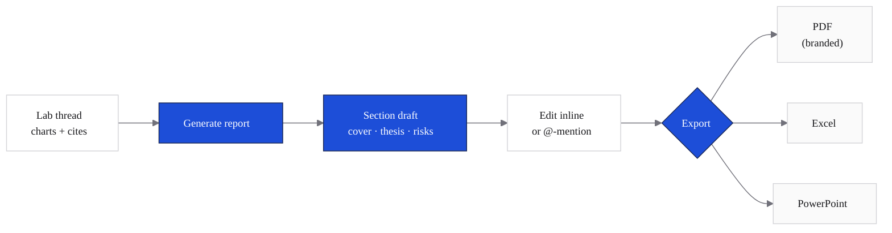

Reports turns a Lab research thread into a publication-ready PDF. The chart, table, and citation work you did in the thread becomes the body of the report; cf0 assembles the cover, sections, footnotes, and Sources Table.

<Frame caption="Reports browser with a PDF preview open — cover page in the firm's brand template, dated entries, pages and word counts per report.">
  
</Frame>

<Frame caption="The report surface — branded cover, body sections with tabular numerals, inline numbered footnotes anchoring to a Sources Table in the appendix.">
  
</Frame>

## What's in a report

- **Branded cover** — your firm's logo, colours, and typeface
- **Investment summary** and key metrics
- **Charts and tables** drawn from the Lab thread (live data, not screenshots)
- **Numbered footnotes** anchored to a Sources Table — see [Citations and audit trail](/security/citations-and-audit#report-grade-citations)
- **Key Assumptions table** before any valuation, so reviewers can swap inputs and see what drives the model
- **Standard sections** — thesis, financials, risks, disclosure

## Generate from a Lab thread

<Steps>
  <Step title="Run the research in Lab">
    Complete a research conversation. The more targeted the thread, the tighter the report.
  </Step>
  <Step title="Click Generate report">
    cf0 reads the conversation and drafts the structure automatically.
  </Step>
  <Step title="Edit the draft inline">
    Click any section to edit text directly. Charts and tables pull from the Lab thread and aren't editable — change them by extending the thread.
  </Step>
  <Step title="Export as PDF">
    Click **Export PDF**. The report renders in your firm's brand template and downloads.
  </Step>
</Steps>

## Export to Excel and PowerPoint

Beyond PDF, cf0 generates native `.xlsx` and `.pptx` from any analysis or uploaded document. Formulas and source links carry through to the spreadsheet; chart objects and section headings carry through to the deck.

## Branding

Reports inherit your organisation's branding automatically. Org admins configure logo, colours, and typeface under [Settings → Brand](/workspace/settings#brand-org-admin-only). Every exported PDF reflects those settings — no manual formatting work.

## The Reports dashboard

The **Reports** page (left sidebar) lists every report you've generated. From the dashboard you can view a report, jump back to the Lab thread that produced it, or delete it. Deleting a report does not delete the underlying Lab thread.
