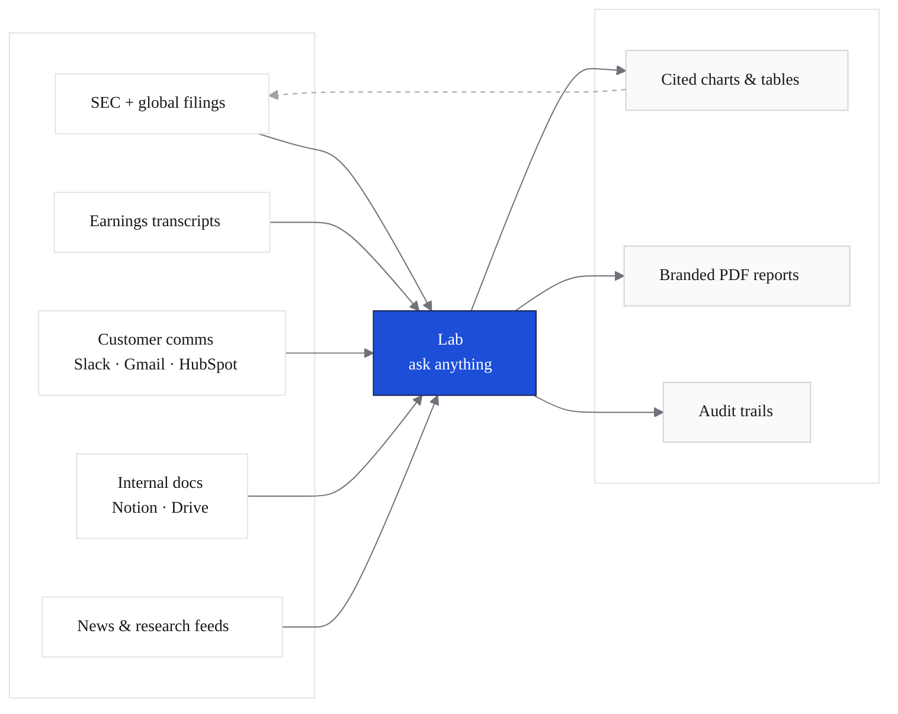

Analysts at hedge funds and family offices spend 87% of their day on data gathering, copy-paste, and cross-checking. cf0 is the **financial intelligence stack** that collapses that work: ask a question, get a cited answer, ship a branded PDF.

In one Lab thread an analyst can pull a <Tooltip tip="Discounted cash flow — a valuation model that projects future free cash flow and discounts it to present value">DCF</Tooltip> on a name, swap the <Tooltip tip="Weighted average cost of capital — the discount rate used in DCF">WACC</Tooltip>, run a sensitivity, draft a <Tooltip tip="Investment committee — the partners who approve trade ideas at hedge funds">IC</Tooltip> memo, and export the PDF in the firm's brand template. The <Tooltip tip="Management's Discussion and Analysis — the narrative section of a 10-K explaining the year's results">MD&A</Tooltip> passage that anchors every figure is one click away.

*Dashed line from outputs back to source: every figure cf0 surfaces is cited back to the exact filing, page, and section.*

## What ships in production

<CardGroup cols={3}>
  <Card title="Lab" icon="message-square" href="/features/lab">
    The research surface. Plain English in, streaming charts, tables, and cited paragraphs out. The model picks the UI the answer needs.
  </Card>
  <Card title="Reports" icon="file-text" href="/features/reports">
    Branded PDFs with numbered footnotes, a Sources Table, and a Key Assumptions table. Ready for IC.
  </Card>
  <Card title="Skills" icon="zap" href="/features/skills">
    Reusable workflows — DCF, LBO, comps, IC memos, earnings recaps — invoked with `/skill-name` from any thread.
  </Card>
</CardGroup>

## What ships from Lab

<CardGroup cols={2}>
  <Card title="Lab" icon="message-square" href="/features/lab">
    Plain English in, streaming charts and tables and cited paragraphs out.
  </Card>
  <Card title="Reports" icon="file-text" href="/features/reports">
    Branded PDFs with numbered footnotes, a Sources Table, and a Key Assumptions table.
  </Card>
  <Card title="SEC + global filings" icon="search" href="/features/filings">
    Every major SEC form structured to section level, plus directory coverage across the global regulators. See [coverage](#sec--global-filings-coverage) below.
  </Card>
  <Card title="Documents" icon="upload" href="/features/documents">
    PDFs, spreadsheets, decks, images — parsed and queryable in the same Lab thread.
  </Card>
  <Card title="Skills" icon="zap" href="/features/skills">
    Reusable workflows — DCF, LBO, comps, IC memos, earnings recaps — invoked with `/skill-name`.
  </Card>
  <Card title="Knowledge" icon="share-2" href="/features/knowledge">
    Topics, notes, sources, and a force-directed graph that explain what cf0 has compiled and where every claim came from.
  </Card>
</CardGroup>

## SEC + global filings coverage

cf0 ingests and structures every filing form an analyst is likely to pull, across ten regulator-backed markets — SEC EDGAR plus nine international regulators.

### SEC forms (US)

| Form | What it carries |
|---|---|
| **10-K** | Annual report — financials, MD&A, risk factors |
| **10-Q** | Quarterly report — interim financials |
| **8-K** | Material events — earnings, leadership, M&A |
| **S-1** | IPO prospectus |
| **DEF 14A** | Proxy — exec comp, board, governance |
| **13-F** | Institutional holdings (quarterly) |
| **N-PORT** | Fund holdings |
| **N-CSR** | Fund certified shareholder reports |
| **N-PX** | Fund proxy voting records |

### Global markets

| Market | Regulator |
|---|---|
| **US** | SEC EDGAR |
| **UK** | FCA / Companies House |
| **Canada** | SEDAR+ |
| **Japan** | EDINET |
| **South Korea** | DART |
| **India** | SEBI |
| **Australia** | ASX |
| **Hong Kong** | HKEX |
| **China** | CNINFO |
| **Brazil** | CVM |

US filings get full section-level extraction (Item 1A risk factors, Item 7 MD&A, etc.) so Lab can quote the exact passage a figure came from. International coverage is directory + filing-list today, with selected markets advancing to full section ingestion — Brazil is the most recent. See [SEC filings](/data/sec-filings) for the full pipeline detail.

## Trust

- Every figure traces to the exact filing, page, and section. Click to verify.
- Reports include numbered footnotes resolving to a Sources Table, plus a Key Assumptions table before every valuation.
- Threads export as compliance-ready audit trails.
- Org-scoped data, never used to train AI models.

See [Security overview](/security/overview) for the full posture.

## Common analyst questions

<AccordionGroup>
  <Accordion title="Where does the math actually happen?" icon="calculator">
    In Python. DCF, WACC, multiples, sensitivities, Monte Carlo — all run as deterministic templates in code, not LLM inference. Same question, same inputs, same answer. See [Guardrails → the model doesn't do math](/security/guardrails#the-model-doesnt-do-math).
  </Accordion>
  <Accordion title="What if cf0 doesn't have the data it needs?" icon="circle-help">
    It says so. From a real generated report: *"EV/Sales requires enterprise value; since debt/cash and shares outstanding are not provided here, EV/Sales is not computed."* cf0 surfaces gaps rather than inventing numbers. See [refuse to fabricate](/security/guardrails#refuse-to-fabricate).
  </Accordion>
  <Accordion title="Can I export an audit trail for IC or compliance?" icon="file-check">
    Yes. Every Lab thread exports as a Markdown or PDF audit trail capturing the full conversation, every tool call and its result, every assumption gate and how it was resolved, every citation with source link, timestamps, and the model version per turn. See [Citations and audit trail](/security/citations-and-audit#exporting-an-audit-trail).
  </Accordion>
  <Accordion title="Does cf0 train on my firm's research?" icon="lock">
    No. Customer threads, documents, and reports never enter any training set. cf0 runs Claude models inside AWS Bedrock — data does not leave AWS to reach a model. See [Data governance](/security/data-governance#boundaries).
  </Accordion>
  <Accordion title="Which models power Lab?" icon="cpu">
    Anthropic's Claude Sonnet 4.6 as the orchestrator and Claude Haiku 4.5 for sub-agents — both via AWS Bedrock. The trace records the exact model version per turn so you can verify after the fact. See [Observability](/security/observability#whats-traced-per-turn).
  </Accordion>
  <Accordion title="How is this different from giving ChatGPT a PDF?" icon="zap">
    Four ways. (1) **Numbers** are computed in deterministic Python templates, not generated by the model. (2) **Citations** trace every figure to the exact filing page. (3) **Audit trails** export per thread. (4) **Compounding context** — every shared document, integration, and memory entry sharpens the next answer across sessions. ChatGPT does none of this for institutional research.
  </Accordion>
</AccordionGroup>

**Next:** [Set up your account →](/quickstart)
