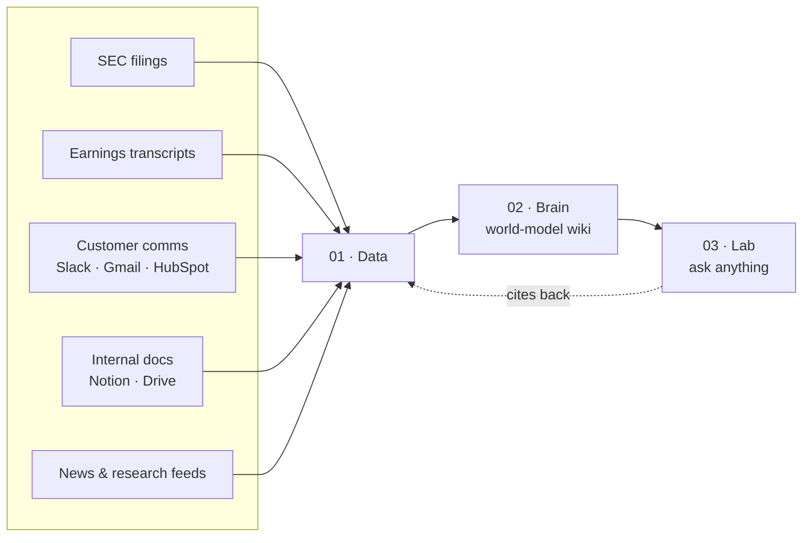

Analysts at hedge funds and family offices spend 87% of their day on data gathering, copy-paste, and cross-checking. cf0 is the **financial intelligence stack** that collapses that work: data feeds a brain that feeds Lab, and you ship cited reports in minutes.

## The three layers

<CardGroup cols={3}>
  <Card title="01 · Data" icon="database">
    SEC filings, earnings transcripts, customer comms (Slack, Gmail, HubSpot), internal docs (Notion, Drive), news, research feeds. Everything your firm reads flows in, structured.
  </Card>
  <Card title="02 · Brain" icon="brain">
    A world-model that compounds. Tracks companies, people, deals, decisions, citations, warnings. Each new source sharpens the next answer.
  </Card>
  <Card title="03 · Lab" icon="message-square">
    Ask anything. Agents pull from the brain, generate on-demand UI matching the question, ship cited reports your PM can read in 30 seconds.
  </Card>
</CardGroup>

## What ships from Lab

<CardGroup cols={2}>
  <Card title="Lab" icon="message-square" href="/features/lab">
    Plain English in, streaming charts and tables and cited paragraphs out.
  </Card>
  <Card title="Reports" icon="file-text" href="/features/reports">
    Branded PDFs with numbered footnotes, a Sources Table, and a Key Assumptions table.
  </Card>
  <Card title="Filings" icon="search" href="/features/filings">
    SEC EDGAR with structured 10-K, 10-Q, 8-K extraction, plus international directory coverage.
  </Card>
  <Card title="Documents" icon="upload" href="/features/documents">
    PDFs, spreadsheets, decks, images — parsed and queryable in the same Lab thread.
  </Card>
  <Card title="Skills" icon="zap" href="/features/skills">
    Reusable workflows — DCF, LBO, comps, IC memos, earnings recaps — invoked with `/skill-name`.
  </Card>
</CardGroup>

## Trust

- Every figure traces to the exact filing, page, and section. Click to verify.
- Reports include numbered footnotes resolving to a Sources Table, plus a Key Assumptions table before every valuation.
- Threads export as compliance-ready audit trails.
- Org-scoped data, never used to train AI models.

See [Security overview](/security/overview) for the full posture.

**Next:** [Set up your account →](/quickstart)
