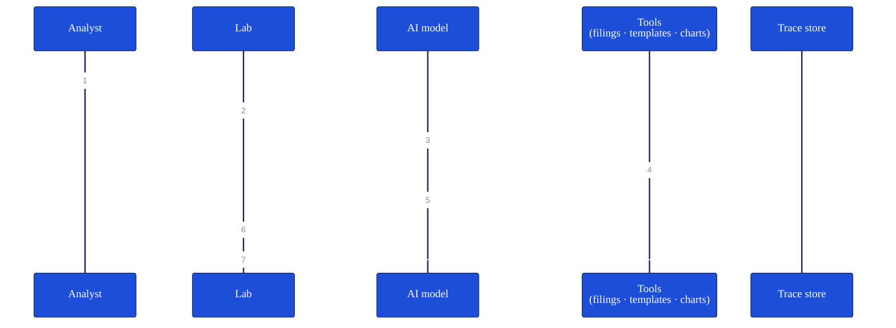

Every Lab turn is fully traced. When you ask a question, cf0 captures the system prompt, the tools called, the model inputs and outputs, the tool execution results, and what was rendered. Traces surface inside the product via the in-app Trace panel and export with the audit trail.

## What's traced, per turn

- **System prompt** — the framing cf0 gives the model
- **Tool definitions** — which tools were available
- **Tool calls** — which tools the model invoked, with arguments
- **Tool results** — what each call returned, with byte size for context-bloat detection
- **Model inputs and outputs** — every token in, every token out
- **Render output** — what was streamed to the chat UI

## Per-agent metrics

cf0 tracks per-agent token usage, tool latency, and rate-limit events. Optimisation decisions are data-driven, not anecdotal.

## What a trace looks like

A single Lab turn captures the tools the model could see, the calls it made, and the bytes each call returned. Conceptually, for a DCF turn:

| Captured | Example |
|---|---|
| Thread | `nvda-q3-readthrough` · turn 4 |
| Tools called | Filings (10-K, Item 7 MD&A) · Consensus (FY26–FY28 revenue) · DCF template (3-stage growth) |
| Output rendered | Bear / Base / Bull fair-value cards · Sensitivity tornado |
| Captured per call | Latency, byte size, input arguments, result summary |
| Audit chain | Every figure on screen walks back to one specific tool call |

**Every figure that ended up on screen can be walked back to one specific tool call** — the MD&A passage to the filings call, the forward projections to the consensus call, the fair-value math to the DCF template. That's the audit chain.

## What you can do with it

- **As an analyst** — open the Trace panel from any thread to see exactly what the model read before it answered.
- **As an org admin** — review per-member token usage and tool patterns on the [Dashboard](/workspace/dashboard).
- **In an audit** — pair traces with the [audit trail export](/security/citations-and-audit) for a turn-by-turn record of how an output was produced.
